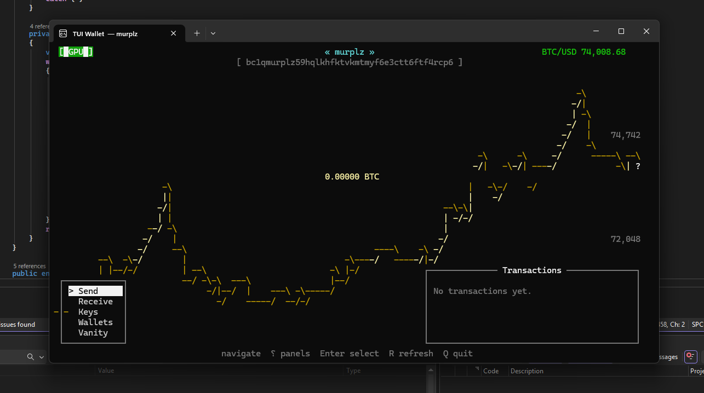

# TUIWallet — Terminal Bitcoin Wallet

A fully featured Bitcoin wallet that runs entirely in your terminal. No browser, no Electron, no GUI — just a fast, keyboard-driven TUI with live price charts, multi-wallet support, and vanity address generation.



---

## Features

- **Live BTC/USD price** — streams from Binance WebSocket, displayed as a yellow line chart scrolling across the background
- **Multi-wallet management** — create, import, label, and switch between wallets
- **Native SegWit addresses** — `bc1q` bech32 format, lowest possible fees
- **Send & Receive** — full transaction signing and broadcast via Blockstream's public API
- **Vanity address generator** — powered by [VanitySearch](https://github.com/JeanLucPons/VanitySearch) with GPU acceleration (CUDA) auto-detected
- **Auto-downloads VanitySearch** — no manual setup required
- **No node required** — all blockchain data comes from [Blockstream Esplora](https://github.com/Blockstream/esplora) public API
- **Testnet support** — run with `--testnet` to use free test Bitcoin

---

## Quick Start

### Option A — Download prebuilt binary (easiest)

1. Go to the [Releases](../../releases/latest) page
2. Download `TUIWallet-win-x64.zip`
3. Extract and run `TUIWallet.exe`

> No .NET installation required — the binary is self-contained.

### Option B — Build from source

**Requirements:**
- [.NET 8 SDK](https://dotnet.microsoft.com/download/dotnet/8.0)

```bash
git clone https://github.com/YOUR_USERNAME/TUIWallet
cd TUIWallet
dotnet run
```

Or build a self-contained release:

```bash
dotnet publish -c Release -r win-x64 --self-contained true -p:PublishSingleFile=true
```

---

## Usage

```
TUIWallet.exe              # mainnet
TUIWallet.exe --testnet    # testnet (free test BTC from a faucet)
```

### Keyboard shortcuts

| Key | Action |
|-----|--------|
| `↑↓` | Navigate menu items |
| `←→` | Switch between menu and transaction panels |
| `Enter` | Select / confirm |
| `R` | Refresh balance and transactions |
| `Q` | Quit |

### First run

On first launch you'll be prompted to either:
- **Create a new wallet** — generates a fresh private key
- **Import existing key** — paste a WIF private key

You'll set a password to encrypt the key. The wallet file is stored in:
- **Windows:** `%APPDATA%\TUIWallet\wallet.json`
- **Linux/Mac:** `~/.config/TUIWallet/wallet.json`

> ⚠️ Your password is never stored. If you forget it, the wallet cannot be recovered.

---

## Vanity Address Generator

Generate a Bitcoin address with a custom prefix — e.g. `bc1qsatoshi...` or `bc1qalex...`.

Select **Vanity** from the menu. TUIWallet will:
1. Auto-detect if a CUDA GPU is available
2. Auto-download [VanitySearch](https://github.com/JeanLucPons/VanitySearch) if not already installed
3. Show live speed (Mkey/s), probability, and ETA while searching
4. Offer to import the found key directly into TUIWallet

**Difficulty guide:**

| Suffix length | Approximate time (GPU) | Approximate time (CPU) |
|--------------|----------------------|----------------------|
| 3 chars | < 1 second | seconds |
| 4 chars | seconds | minutes |
| 5 chars | minutes | hours |
| 6 chars | hours | days |

> Each additional character is ~32x harder for `bc1q`/`bc1p` addresses.

---

## Credits & Dependencies

| Project | Author | License | Use |
|---------|--------|---------|-----|
| [VanitySearch](https://github.com/JeanLucPons/VanitySearch) | [Jean-Luc Pons](https://github.com/JeanLucPons) | GPL-3.0 | Vanity address generation — the core search engine behind the Vanity feature. Highly optimised C++ with CUDA GPU support. |
| [NBitcoin](https://github.com/MetacoSA/NBitcoin) | [Nicolas Dorier](https://github.com/NicolasDorier) | MIT | Bitcoin key management, address derivation, transaction signing |
| [Blockstream Esplora API](https://github.com/Blockstream/esplora) | Blockstream | MIT | Balance, transactions, UTXO, fee estimates, broadcast |
| [Binance WebSocket API](https://binance-docs.github.io/apidocs/spot/en/#aggregate-trade-streams) | Binance | Public | Live BTC/USD price stream |

### Special thanks to VanitySearch

VanitySearch by Jean-Luc Pons is an extraordinary piece of work — a hand-optimised C++ Bitcoin address prefix finder with inline CUDA PTX assembly, custom 256-bit arithmetic, and multi-GPU support. It can search hundreds of millions of keys per second on a modern GPU. TUIWallet uses it as a subprocess and credits it fully. If you find it useful, [star the repo](https://github.com/JeanLucPons/VanitySearch).

---

## Security notes

- Private keys are encrypted with XOR using your password before being saved to disk
- **XOR is intentionally simple** — this wallet is a learning/hobby project, not hardened for large amounts of BTC
- For serious use, consider upgrading the encryption to AES-256-GCM (straightforward change in `Keymanager.cs`)
- The wallet files in `%APPDATA%` are **not** part of this repository — your keys never touch GitHub
- Always test on **testnet** first (`--testnet` flag)

---

## Testing on testnet

1. Run `TUIWallet.exe --testnet`
2. Create a wallet and copy your `tb1q...` address
3. Get free testnet BTC from a faucet:
   - https://coinfaucet.eu/en/btc-testnet/
   - https://testnet-faucet.mempool.co/
4. Wait ~10 minutes for confirmation, then refresh with `R`

---

## Contributing

Pull requests welcome. Some ideas:

- [ ] AES-256-GCM encryption for wallet files
- [ ] HD wallet / BIP39 mnemonic support
- [ ] Multiple address support per wallet
- [ ] Transaction history export
- [ ] xclip / xsel clipboard support on Linux

---

## License

MIT — do whatever you want with it.

VanitySearch (used as a subprocess) is GPL-3.0 — see [its license](https://github.com/JeanLucPons/VanitySearch/blob/master/LICENSE.txt).
